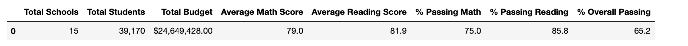
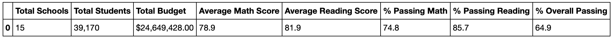
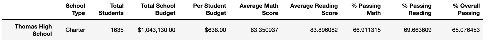
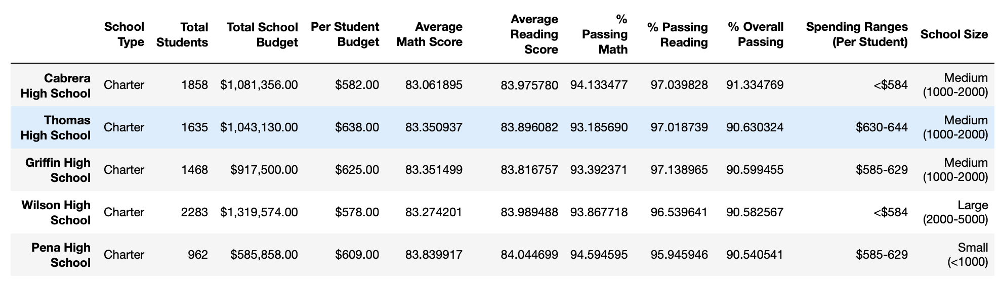

## Overview 

Through the use of Pandas Library, this project aims to help the school district determine the budget that should be allocated to and spent on each school based on the students performance. For the analysis, two datasets in csv format were used; the schools_complete.csv and students_complete.csv, and an initital overall analysis was conducted with the complete datasets. However, since the students_complete.csv file showed evidence of academic dishonesty; specifically, reading and math grades for Thomas High School ninth graders appeared to have been altered, the math and reading scores for Thomas High School were replaced with NaNs while keeping the rest of the data intact to determine how these changes affected the overall analysis.

## School District Analysis Results 

- Based on the results of the district summary after replacing the Thomas High School ninth graders math and reading scores with NaNs (Fig. 2) we can obserse that the Average Math Score,	Average Reading Score,	% Passing Math,	% Passing Reading &	% Overall Passing were not significantly affected since if we round both summary results to the next whole number, the results would be the same. 

*Fig.1 Initial District Analysis*

*Fig.2 District Analysis after Thomas High School ninth graders removal*

- After the removal of Thomas High School ninth graders, and recalculating the percentage of students who passed math, passed reading, and passed both math and reading for Thomas High School only, the school performance improved by going from 66.91, 69.66, 65.08 for % Passing Math, % Passing Reading, % Overall Passing (Fig. 3) to 93.19, 97.02 and 90.63 respectively (Fig. 4). 

*Fig.3 Thomas High School initial Dataframe*

*Fig.4 Thomas High School updated Dataframe*

- After replacing the ninth graders’ math and reading scores, Thomas High School went from the bottom 5 performing schools, with a 65.08% of Overall Passing, to the top 5 performing schools with 90.63% of Overall Passing.

- Replacing the ninth-grade scores, did not affect the math and reading scores by grade.
- Replacing the ninth-grade scores, did not affect the scores by school spending.
- Replacing the ninth-grade scores, did not affect the scores by school size.
- Replacing the ninth-grade scores, did not affect the scores by school type.

## Summary 

The four major changes in the updated school district analysis after reading and math scores for the ninth grade at Thomas High School have been replaced with NaNs are: 

- Thomas High School performance improved by going from 66.91% Passing Math to 93.19% Passing Math.
- Thomas High School performance improved by going from 69.66% Passing Reading to 97.02% Passing Reading.
- Thomas High School performance improved by going from 65.08% Overall Passing to 90.63% Overall Passing.
- After replacing the ninth graders’ math and reading scores, Thomas High School went from the bottom 5 performing schools, with a 65.08% of Overall Passing, to the top 5 performing schools with 90.63% of Overall Passing.

